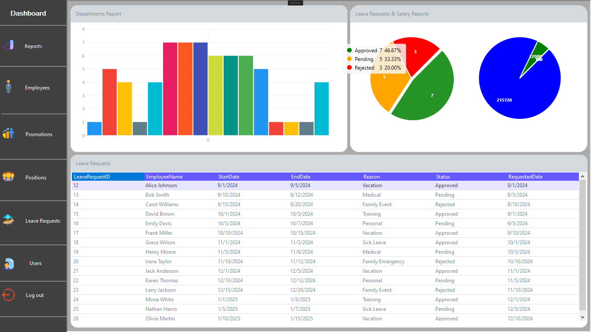
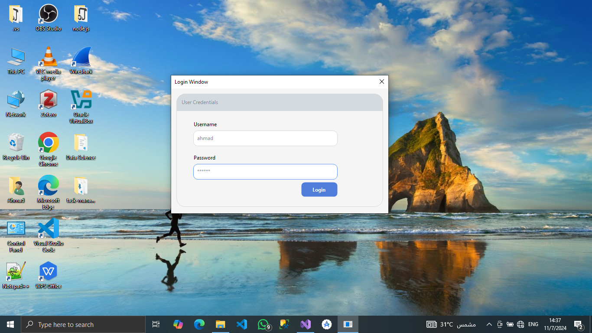
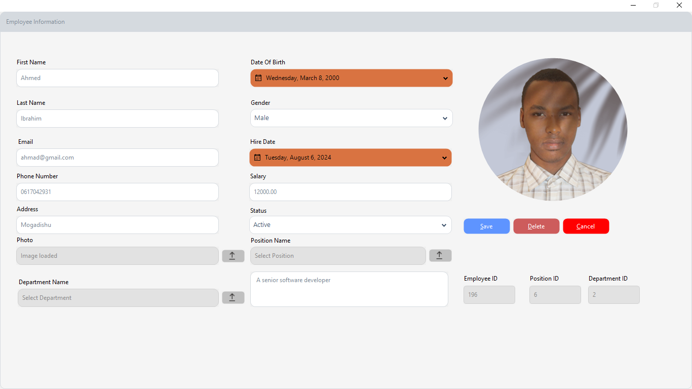

Here is the README in a structured Markdown format:

# HRMaster

## Description
**HRMaster** is a Windows Forms application designed to streamline human resources management for small to medium-sized organizations. This application provides essential tools to manage employees, handle leave requests, and analyze salaries, along with a dashboard to display key HR insights. Built with C#, MS SQL Server, the Guna UI Library, and LiveCharts, HRMaster offers a smooth user experience and powerful HR analytics.

## Table of Contents
- [Features](#features)
- [Screenshots](#screenshots)
- [Technologies Used](#technologies-used)
- [Setup and Installation](#setup-and-installation)
- [Usage](#usage)
- [Future Improvements](#future-improvements)
- [Contributing](#contributing)
- [License](#license)

## Features
- **Employee Management**: Manage employee information, update details, and view employee records.
- **Leave Requests**: Handle leave requests with options to approve or reject and view history.
- **Department Insights**: Analyze department-specific metrics.
- **Salary Analysis**: View salary details, generate reports, and analyze trends.
- **Comprehensive Dashboard**: Access a dashboard displaying important HR statistics.

## Screenshots
Here are some screenshots showcasing the application's features:

- **Dashboard**  
  

- **Login**  
  

- **Employee Registration**  
  

- **Leave Requests**  
  

## Technologies Used
- **C#**
- **MS SQL Server** for data management
- **Guna UI Library** for enhanced UI/UX components
- **LiveCharts** for data visualization in charts and graphs

## Setup and Installation

1. **Clone the repository**

   ```bash
   git clone https://github.com/MasterWithAhmad/HRMaster.git
   cd HRMaster

2. Open the Project

Open HRMaster.sln in Visual Studio.


3. Database Configuration

Create a database in MS SQL Server manually.

# Update the connection string in App.config with your SQL Server settings:
```
<connectionStrings>
  <add name="DefaultConnection" 
       connectionString="Data Source=your_server_name;Initial Catalog=HRMasterDB;Integrated Security=True" 
       providerName="System.Data.SqlClient" />
</connectionStrings>
```


# 4. Build and Run

Use Visual Studio Developer Command Prompt to build the solution:
```
msbuild HRMaster.sln
```
Run the application from Visual Studio to start using HRMaster.


# Usage

1. Login with valid credentials.


2. Navigate to the Dashboard for an overview of HR statistics.


3. Use Employee Management to add, edit, or delete employee records.


4. Access Leave Requests to manage employee leave.


5. Explore Salary Analysis for salary trend insights.


# Future Improvements

Role-based authentication for different HR roles.

Integration with external payroll systems.

Enhanced data visualization for salary and leave trends.


# Contributing

Contributions are welcome! Please fork the repository, make your changes, and submit a pull request for review.

# License

This project is licensed under the MIT License. See the LICENSE file for more details.

